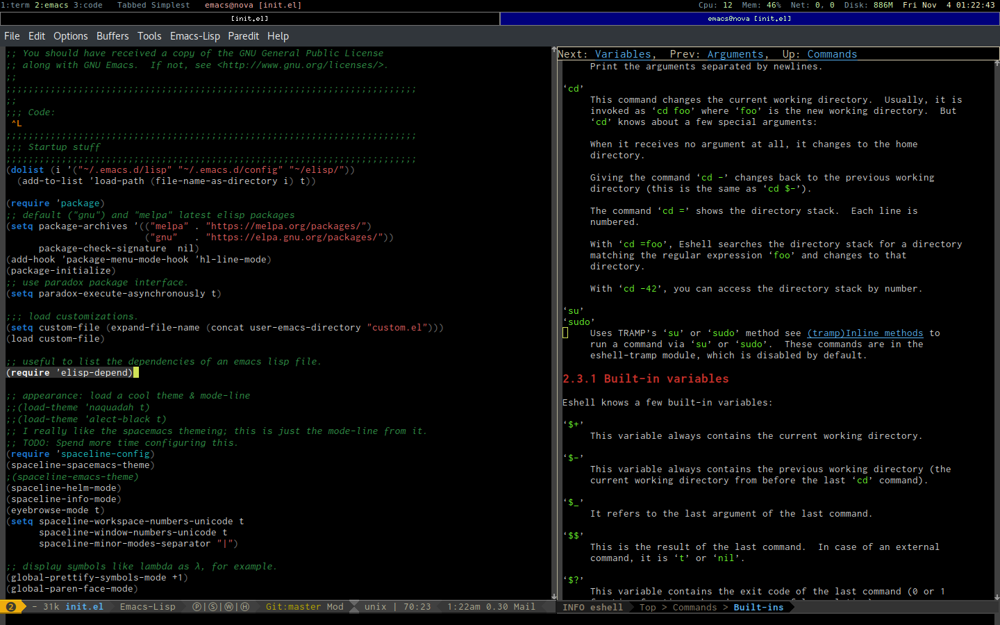

# dot.emacs.d

## From my laptop running Arch Linux. ##

This is my GNU Emacs 25.1 initialization file now moved from ~/.emacs
to ~/.emacs.d/init.el, in the process adding many new features and
customizations from MELPA packages. 

Not a lot more to add really, feel free to use bits or all of it as
you see fit, it contains the elisp code I've found the most useful
over the years (I've been using emacs for a long time), together with
recently discovered gems from the MELPA package archives. 

*“Don’t get set into one form, adapt it and build your own, and let it
grow, be like Emacs. Empty your mind, be formless, shapeless — like
Emacs. If you put Emacs in a cup it becomes the cup, if you put into a
bottle it becomes the bottle. You put Emacs into a teapot it becomes
the teapot. Now, Emacs can flow or it can crash. Be Emacs, my friend.”*

